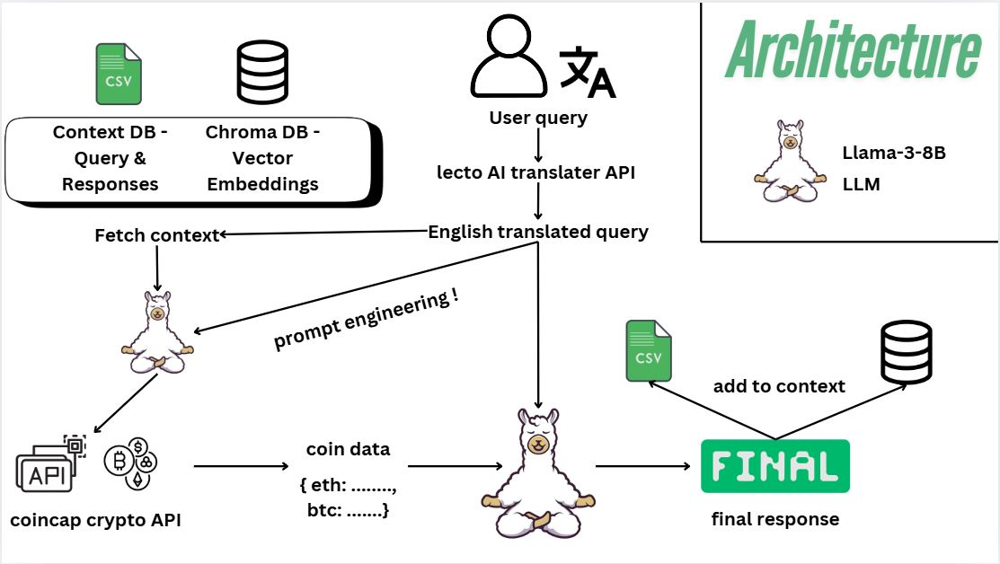

# Cryptocurrency AI Agent Assignment

[](./assets/architecture.JPG)

This repository contains my submission for the AI Agent Assignment, designed to demonstrate the implementation of a cryptocurrency chatbot with Together AI's LLaMA 3.1 8B model. The agent fetches live cryptocurrency prices, handles multilingual user queries, and maintains conversational context across sessions.

---

## 📋 Table of Contents
1. [Overview](#overview)
2. [Features](#features)
3. [Setup Instructions](#setup-instructions)
4. [Demos](#demos)
5. [Documentation](#documentation)
6. [Limitations](#limitations)
7. [Acknowledgments](#acknowledgments)

---

## 🔍 Overview
This project demonstrates:
- Integration with **Together AI's LLaMA 3.1 8B** model for conversational capabilities.
- Use of **Public Cryptocurrency APIs** to fetch real-time cryptocurrency prices.
- Multilingual input handling by translating non-English queries into English while maintaining all responses in English.
- Session-based context management to preserve conversational flow and prevent cross-session context collisions.
  

---

## 🌟 Features
### Core Features:
1. Fetch live cryptocurrency prices (e.g., Bitcoin, Ethereum).
2. Maintain session-based context for a seamless conversational experience.
   - A **new context DB** and **vector DB** are created for each session to avoid context collision.
3. Robust error handling for API failures and invalid inputs.

### Bonus Features:
1. Multilingual support: Translate user queries into English while ensuring all responses remain in English.
2. Efficient handling of LLM calls:
   - Limited to **two LLM calls per interaction** to optimize performance.
3. **Launchable as a Streamlit application** for a user-friendly interface.

---

## 🛠️ Setup Instructions

### 1. Clone the Repository
```bash
git clone https://github.com/tenseisoham/FDSE-at-Sarvam.ai---Soham-Petkar.git
cd crypto-ai-agent
```

### 2. Create a Virtual Environment
Use Conda to create and activate a Python 3.11.8 environment:
```bash
conda create -n crypto-agent python=3.11.8
conda activate crypto-agent
```

### 3. Install Dependencies
Install required Python packages:
```bash
pip install -r requirements.txt
```

### 4. Configure API Keys
Add your API keys:
- **Together AI API Key** in `chat/llm_agent.py`:
  ```python
  TOGETHER_API_KEY = "your_together_api_key_here"
  ```
- **Lecto API Key** in `utils/translation.py`:
  ```python
  LECTO_API_KEY = "FQPKAF3-ANCM7VR-H3QT99G-3RRYF6H"
  ```

### 5. Launch the Streamlit Application
After updating the API keys, launch the application:
```bash
streamlit run streamlit_app.py
```

---


## 📂 Demos
All performed demos are available in the [`demo/`](./demo/) folder. These demos showcase the AI agent's capabilities, including:
- Handling cryptocurrency price queries.
- Responding to multilingual inputs.
- Maintaining conversational context across sessions.

Feel free to explore the demo files to see the agent in action.

---

## 📚 Documentation
Detailed implementation and design documentation is available [here](./docs/README.md).

---

## 🔎 Limitations
1. **Real-Time Cryptocurrency Prices**:
   - The cryptocurrency API returns fluctuating prices, which are updated every second. 
   - Caching is not implemented for price data to maintain real-time accuracy and because of the inherent structure/nature of the API response
   - API used - (https://api.coincap.io/v2/assets)
   - use (https://api.coincap.io/v2/assets/bitcoin) for fetching Bitcoin info specifically.

2. **LLM Limitations**:
   - Despite extensive prompt engineering, occasional hallucinations may occur due to the model's 8B parameter size.
   - Translating user queries introduces an additional API overhead.

3. **Translation Example**:
   - Given an **Hindi query**, such as:
     > "muze ethereum ki rank janni he"
   - The agent successfully translates and responds in English:
   - [Example Screenshot](./assets/hindi_trial.JPG)

---

## 🙏 Acknowledgments
A big thanks to **Sarvam.ai** for designing this wonderful assignment. It has significantly enhanced my understanding of:
1. Implementing API integrations and prompt engineering.
2. Building end-to-end conversational AI agents from scratch.

